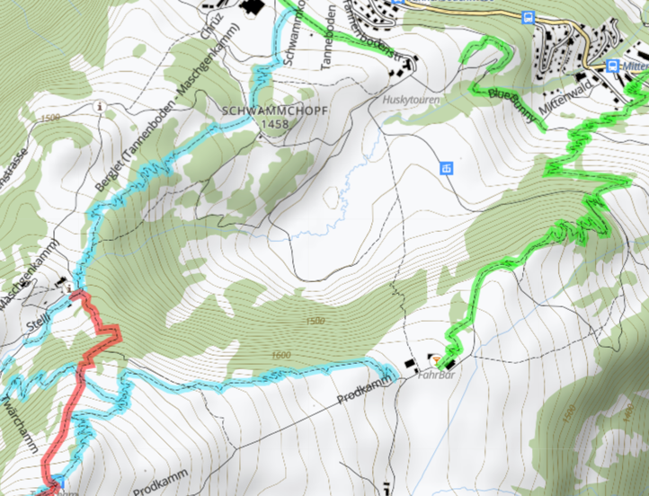

# singletrail-tiles

Additional maps and overlays for https://bikerouter.de (or https://gpx.studio) that highlight singletrails for mountain biking.
They can be added as custom base maps and overlays.

## Introduction

https://bikerouter.de and https://gpx.studio are tremendously useful tools to prepare GPX tracks for cycling adventures.
However, I was never happy with the available options of maps and overlays highlighting singletrails for mountain biking
that would let me choose the best singletrails according to my bike riding skills. Being used to the
[swiss map style](https://prod-swishop-s3.s3.eu-central-1.amazonaws.com/2022-08/symbols_en.pdf) I was looking for something
that looked like a swisstop map with simple highlights of singletrails from green to black (just like ski pistes) according
to their [difficulites](https://wiki.openstreetmap.org/wiki/Key:mtb:scale).



## Serving the Singletrail Map Tiles

The singletrail map is served to e.g. https://bikerouter.de as `.png` tiles by a map tile server that is running on your local computer.
https://bikerouter.de will automatically load the `.png` tiles as needed when scrolling the map.

### Prerequisites

In order to run this project locally you need `git` as well as `docker` and `docker-compose` installed on your computer.

Additionally, an `.mbtiles` file containing the map data must be generated first for the desired area.
Use my [openmaptiles-singletrailmap project](https://github.com/joe-akeem/openmaptiles-singletrailmap) to create an `.mbtiles`
file for the desired area. For example to create suitable data for the area of the whole alps, you would run

```bash
$ ./quickstart.sh europe/alps
```

in that project. The resulting `tiles.mbtiles` file must then be copied to this project's `data` folder.

### Running the Tile Server

1. Clone the project to your local computer:

```bash
$ git clone https://github.com/joe-akeem/singletrail-tiles.git
$ cd singletrail-tiles
``` 

2. Copy the `tiles.mbtiles` file (see above):

```bash
$ cp ../openmaptiles-singletrailmap/data/tiles.mbtiles data
``` 

3. Run the tile server:

```bash
$ docker-compose up
``` 

In order to verify that the tile server is running properly visit http://localhost:8080/. You should be able to inspect
the data as well as a list of map styles.

### Adding the custom Singletrail Basemap and Overlays to bikerouter.de

From the main page at http://localhost:8080/ you can navigate to the TileJSON definitions of each style. Each style has
an individual URL at which the map tiles are served. They look something like `http://localhost:8080/styles/mtb/{z}/{x}/{y}.png`.
These URLs are the ones https://bikerouter.de (or https://gpx.studio) needs to request the map tiles depending on the currently displayed section of the map.

Here is a list of the provided styles along with the URLs that are relevant to https://bikerouter.de and https://gpx.studio:

|Style|Description|Tiles URL|
|---|---|---|
| mtb | A map style that can be used as an _overlay_ to highlight the paths on the map that have an `mtb_scale` tag according to OSM. The paths are highlighted using different colors depending on the [riding difficulty](https://wiki.openstreetmap.org/wiki/Key:mtb:scale) (green for S0, blue for S1 etc.) |http://localhost:8080/styles/mtb/{z}/{x}/{y}.png |
| mtb_potential | A map style that can be used as an _overlay_ to highlight the paths on the map that might be suitable for MTB riding but that don't have an `mtb_scale` tag according to OSM. The paths are highlighted using different colors depending on the how likely they are suited (based on some other tags like hiking difficulty etc. Orange means higher potential than yellow) |http://localhost:8080/styles/mtb_potential/{z}/{x}/{y}.png |
| singletrailmap | A map that can be used as a _base map_. It is a complete map style that is similar to the swisstopo style and that has additionally the singletrails highlighted as in the `mtb`style above. This map can be combined with other overlays in gpx.studio. | http://localhost:8080/styles/singletrailmap/{z}/{x}/{y}.png |

The map layers can be added to e.g. https://bikerouter.de as custom layers. Make sure you choose the right layer type. `Overlay`
is meaningful for the `mtb`and `mtb_potential` styles while `singletrailmap` is more suitable as `Basemap`.

Once the custom layers have been added in https://bikerouter.de or https://gpx.studio, they can be randomly mixed with the
already existing layers.


